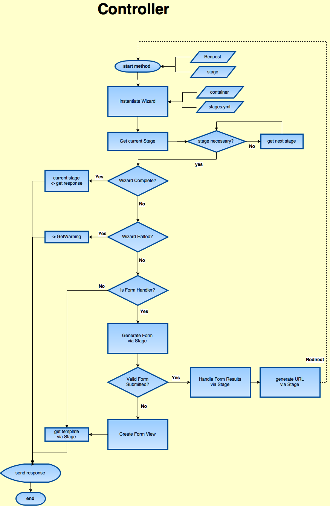

Wizard
======

The Wizard Component is a management tool for multi-stage user interaction. It utilizes several Interfaces and the
Wizard class to create a workflow that is compatible with Symfony Forms and Twig templating. Relying on the concept of
**Stages**, the developer is able to define a sequence using a `.yml` file and control that sequence in their Controller.

On instantiation, the Wizard class requires the **Symfony Container** and a full path to the **stage definition file**
(in yaml format). The Wizard will load the stage definitions from there. The Wizard Component includes a YamlFileLoader
for this purpose.


Stage
-----

A Stage is simply a class which implements the StageInterface. It defines a **name**, a **template name** and any
**template parameters** that stage will require. A stage must also define whether it is **necessary** by possibly
completing some logic and returning a boolean. Stages marked as NOT **necessary** will be skipped following their
instantiation and processing of the `isNecessary()` method, allowing that stage to complete tasks as needed before
proceeding. Stages are skipped when the Wizard calls the `getCurrentStage()` method.

Stages may optionally implement:
 - `InjectContainerInterface` if the Stage requires the Symfony container
 - `FormHandlerInterface` if the Stage will be using a Symfony Form
 - `WizardCompleteInterface` to indicate the wizard is finished and wrap up any logic at the end.

The Wizard can be halted in the `isNecessary()` method by throwing an `AbortStageException`. The message of which is
available for retrieval using `$wizard->getWarning()`.


Stage Definition File
---------------------

The stage definition file is a simple yaml file. The first key `stages:` is required and then each stage should be
listed by `name` and each should have properties `class` and `order`. The `name` key must be the same as the name of the
stage as set in its Stage class. The `class` property should be the fully-qualified classname (with namespace) and the
`order` property should be an integer identifying the sequential order of the stage. Optionally, a stage can be
identified with a `default` property which should be set to true. This stage will be used by the wizard if no stage
argument is provided.


###Sample stages.yml

```yaml
stages:
    prep:
        class: Acme\Bundle\DemoBundle\Stage\PrepStage
        order: 1
        default: true
    getinfo:
        class: Acme\Bundle\DemoBundle\Stage\GetInfoStage
        order: 2
    noform:
        class: Acme\Bundle\DemoBundle\Stage\NoFormStage
        order: 3
    complete:
        class: Acme\Bundle\DemoBundle\Stage\CompleteStage
        order: 4
    nonstage:
        class: Acme\Bundle\DemoBundle\Stage\NonStage
        order: 99
```


###Sample Controller

```php
use Symfony\Component\HttpFoundation\Response;
use Symfony\Component\HttpFoundation\RedirectResponse;
use Symfony\Component\HttpFoundation\Request;
use Zikula\Component\Wizard\FormHandlerInterface;
use Zikula\Component\Wizard\Wizard;
use Zikula\Component\Wizard\WizardCompleteInterface;

class MyController
{
    private $container

    /**
     * define route = 'index/{stage}'
     */
    public function indexAction(Request $request, $stage)
    {
        // begin the wizard
        $wizard = new Wizard($this->container, realpath(__DIR__ . '/../Resources/config/stages.yml'));
        $currentStage = $wizard->getCurrentStage($stage);
        if ($currentStage instanceof WizardCompleteInterface) {
            return $currentStage->getResponse($request);
        }
        $templateParams = $currentStage->getTemplateParams();
        if ($wizard->isHalted()) {
            $request->getSession()->getFlashBag()->add('danger', $wizard->getWarning());
            return $this->container->get('templating')->renderResponse('MyBundle::error.html.twig', $templateParams);
        }

        // handle the form
        if ($currentStage instanceof FormHandlerInterface) {
            $form = $this->container->get('form.factory')->create($currentStage->getFormType());
            $form->handleRequest($request);
            if ($form->isSubmitted() && $form->isValid()) {
                $currentStage->handleFormResult($form);
                $url = $this->container->get('router')->generate('index', array('stage' => $wizard->getNextStage()->getName()), true);

                return new RedirectResponse($url);
            }
            $templateParams['form'] = $form->createView();
        }

        return $this->container->get('templating')->renderResponse($currentStage->getTemplateName(), $templateParams);
    }
}
```


